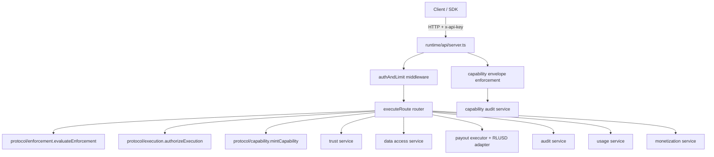

# AOC Protocol — Platform Readiness Assessment (2026-05-15)

## Scope & Method

This assessment maps **current implemented architecture** only (no speculative redesign), based on repository code inspection and build/test signals.

Primary focus areas:
- runtime core, auth, permissions/policy/capability evaluation
- audit, storage, adapters
- SDK readiness and external API surfaces
- tenancy boundaries, execution flow
- enterprise/vertical coupling
- deployment/config assumptions

---

## 1) Runtime architecture map

### 1.1 Layer map (as-built)

### 1.2 Execution flow (hosted path)

1. `createRuntimeServer` validates endpoint/method.
2. `authAndLimit` resolves API key and rate tier.
3. payload parse (JSON for POST, query params for GET).
4. selective capability-token enforcement on `/data/access` and `/payout/execute`.
5. `executeRoute` dispatches to protocol core or hosted service.
6. `deriveDecision` computes logging decision/reason.
7. optional usage/metering side effects for metered endpoints.
8. unified response envelope emitted.

---

## 2) Coupling map

### 2.1 Strong couplings

- **API router ⇄ monolithic runtime core object**: one `RuntimeCore` aggregates protocol + many hosted services.
- **API server ⇄ capability enforcement implementation details** (headers + payload shape assumption for subject/requester IDs).
- **Usage ⇄ monetization coupling** in request success path (fire-and-forget chained side effects).
- **Payout ⇄ trust service + RLUSD adapter** hardwired in default core.
- **SDK ⇄ route strings** (string-literal paths directly embedded in methods).

### 2.2 Compile/export boundary coupling risks

- `runtime/index.ts` re-exports modules that appear absent from tree (`./controlPlane`, `./runtime-negotiation`, `./governance-treaties`).
- `runtime/api/routes.ts` imports `../controlPlane` that is not present under `runtime/` directory listing.

This indicates **API surface drift** between intended and present module topology.

---

## 3) Stable primitives map

Likely platform-grade primitives already stable enough for reuse:

- **Capability token canonicalization/hash/mint/verify pipeline** (`capability/*`, `aoc/capabilities/tokens/*`).
- **Deterministic capability access evaluation** (`aoc/capabilities/core/evaluateCapabilityAccess.ts`).
- **Runtime consumption primitives with pluggable registries** (`consumeCapabilityAccess` + in-memory registries).
- **Unified API response envelope and endpoint type model** (`runtime/types/api-types.ts` + route helpers).
- **Auth + rate-limit middleware contract** (simple and reusable at edge/API boundary).
- **Usage + pricing abstraction points** (`InMemoryUsageService`, `InMemoryMonetizationService`, pricing registry).

---

## 4) Candidate public APIs

Most defensible public APIs now:

1. **Hosted Runtime HTTP API**
   - enforcement/authorization/capability mint
   - trust, payout, data access, audit, usage endpoints
2. **HostedRuntimeClient SDK remote interface**
   - explicit hosted-only vs local-only behavior is clear for core operations.
3. **Capability SDK (`aoc/sdk`) flow API**
   - `executeCapabilityFlow` as single orchestration entrypoint for evaluation+consumption+interpretation.

Suggested rule: freeze only endpoints currently backed by tests and by actual modules (exclude surfaces referencing missing modules).

---

## 5) Candidate SDK exports

### 5.1 Keep/export as stable
- capability token mint/validate/verify
- consent object build/validate
- evaluate + consume capability access
- execute capability flow
- typed reason codes and core decision types

### 5.2 Keep internal (not public yet)
- in-memory stores/services as default infra internals
- RLUSD-specific payout adapter types as vertical implementation details
- endpoint path literals duplicated across server/client without generated contract

---

## 6) Dangerous coupling areas

1. **Missing-module export/import leakage** at runtime package boundary (high risk for consumers).
2. **Enterprise/vertical leakage into protocol-adjacent runtime defaults**:
   - RLUSD payout path and trust workflow coupled into default core composition.
3. **Identity semantics mixed across layers** (`subject_hash`, `consumer_id`, `subject_id`, `requester_id`) with implicit mapping.
4. **In-memory persistence everywhere** (keys, trust, audit, usage, pricing) creates false stability under load/restart.
5. **Config fallback secrets** (`aoc_runtime_capability_secret`) and soft-mode fallback can cause insecure default deployment.
6. **Route-level decision derivation** is manually enumerated, prone to drift as endpoints evolve.

---

## 7) Hardening recommendations (non-invasive)

1. **Boundary integrity pass (highest priority)**
   - reconcile `runtime/index.ts` exports with actual files
   - reconcile `routes.ts` imports to existing modules
   - add CI check for dangling exports/imports.

2. **Contract centralization**
   - single source for endpoint literals + request/response schemas consumed by both server and SDK.

3. **Identity vocabulary normalization**
   - codify canonical principal fields and adapters at edge.

4. **Security defaults**
   - fail startup if capability secret is default in non-dev env.
   - explicit strict/soft mode visibility in startup logs and health endpoint.

5. **Durability abstraction without rewrite**
   - keep current interfaces; add storage provider interfaces and adapters gradually (audit, usage, API keys).

6. **Metering reliability**
   - move fire-and-forget usage+billing into resilient queue interface (same logical flow, safer delivery).

7. **Build graph hardening**
   - address TypeScript workspace rootDir/include leakage and node type setup; ensure each package compiles in isolation.

---

## 8) Platform readiness score by subsystem

| Subsystem | Readiness (0-10) | Notes |
|---|---:|---|
| Capability core evaluation | 8.0 | Strong deterministic core and reason codes. |
| Capability runtime consumption | 7.5 | Good primitives; persistence mostly in-memory. |
| Hosted API runtime core | 6.0 | Good flow; boundary drift and implicit contracts reduce confidence. |
| Auth + rate limits | 5.5 | Functional but in-memory, static seeded keys. |
| Trust/identity | 5.5 | Structured service, but semantics coupled to hosted flows. |
| Policy/permissions orchestration | 5.0 | Works via composed route logic; naming/identity contracts implicit. |
| Audit | 5.5 | API surface present; durability and cross-domain consistency still weak. |
| Usage + monetization | 5.0 | Useful foundation; async side-effect reliability gap. |
| Payout adapters | 4.5 | Vertical RLUSD coupling in defaults; not yet adapter-ecosystem ready. |
| SDK (runtime client) | 6.5 | Clear remote/local split; contract duplication risk. |
| External API surface governance | 4.5 | Missing module exports/imports indicate unstable surface. |
| Tenancy boundaries | 4.0 | API key owner/tier exists; tenant isolation model not explicit. |

---

## 9) Refactor priority list (stabilization-only)

1. **Fix package boundary drift** (missing imports/exports).
2. **Publish canonical API contract package** (types + endpoint constants).
3. **Normalize principal/identity contract across endpoints.**
4. **Introduce pluggable persistent stores behind existing service interfaces.**
5. **Decouple RLUSD/trust defaults from generic runtime core composition.**
6. **Add startup validation for security-sensitive config.**
7. **Add architecture fitness tests** (endpoint parity, decision mapping coverage, export integrity).

---

## 10) “Do NOT touch yet” list

To avoid destabilizing working systems prematurely:

- Do **not** rewrite `executeCapabilityFlow` orchestration shape.
- Do **not** replace route-level runtime composition with a framework migration yet.
- Do **not** generalize payout domain beyond existing adapter seam until contract package is stable.
- Do **not** introduce distributed persistence rewrite before API/identity contracts are frozen.
- Do **not** collapse protocol and hosted runtime layers; current separation is directionally correct.

---

## Enterprise leakage into protocol / vertical leakage summary

- **Enterprise leakage risk**: hosted concerns (API keys, monetization, trust workflows, payout callbacks) are adjacent to protocol exports via broad `runtime/index.ts` re-export strategy.
- **Vertical leakage risk**: RLUSD payout path currently participates in default runtime composition, reducing neutrality of base hosted runtime.
- **Mitigation strategy**: keep protocol primitives pure, move enterprise/vertical modules behind explicit opt-in composition roots.

---

## Deployment & config assumptions observed

- single-process in-memory stores assumed across auth/rate/trust/audit/usage/monetization.
- default secret fallback present for capability enforcement.
- enforcement mode defaults to soft unless env forces strict.
- no explicit multi-tenant storage partitioning or regional consistency strategy in hosted path.

